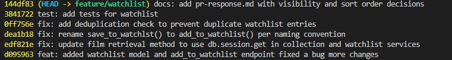

# PR Response Doc — CineLog Watchlist Feature
## Commit Messages

## AI Usage

AI helped with searching for save_to_watchlist call in the project so I can rename it to add_to_watchlist. It also advisd that I wire the AlreadyIn WatchlistError in the watchlist.py. And also helped with the commit messages.

My test was failing saying attribute error wathlistentry has no attribute film. Copilot suggested to add a relationship on WathclistEntry, and I asked it that I see a relationship for collection on Film, and if I can do the same for WatchlistEntry. It confirmed that's a cleaner way.

I also used AI for the comment 6 — Rebase. It helped me to understand what conflicted, how to resolve it, and how to verify no conflict remains.

## Comment 1 — Rename
**What I did:**
I went to services/watchlist_service.py and renamed the function save_to_watchlist to add_to_watchlist. 

**How I verified:**
By using Ctrl+shift+F, I searched for all instances of save_to_watchlist in the project and replaced them with add_to_watchlist.

## Comment 2 — Deduplication
**What I did:**
I follwed the structure to handle duplicate error in services/collection_service.py and added a try/except block in services/watchlist_service.py to catch the AlreadyInWatchlistError and return a message to the user.

**How I verified:**
I also wired this error in the watchlist.py file to ensure that the error is raised when a user tries to add a movie that is already in their watchlist.

## Comment 3 — Missing test
**What I did:**
I created the test_watchlist.py and copied everything from test_collection.py and changed the function names to reflect the watchlist feature. I also added a test for the AlreadyInWatchlistError to ensure that it is raised when a user tries to add a movie that is already in their watchlist.

**How I verified:**
I ran the tests using pytest and one test saying attribute error watchlistentry has no attribute film. I used same pattern i have for collection in class Film and added a relation ship on Film so WatchlistEntry can access the film attribute through the backref.

## Comment 4 — Default visibility
**My position:**
I think public=True is a good default for watchlists.

**Reasoning:**
A watchlist is often something people like to share. Making it public by default makes it easy for friends with similar movie or TV tastes to see each other's watchlists, discover new titles, and get recommendations without needing to change any settings first. If someone wants to keep their watchlist private, they can still change the visibility later.

**Tradeoff acknowledged:**
Some users may not be comfortable with their watchlist being public by default and may expect it to be private. This could raise privacy concerns. Because of that, the app should clearly show that the watchlist is public when it is created and make it easy for users to change the setting if they want.

## Comment 5 — Sort order
**My position:**
I was hesitant at first, since being able to see the watchlist entries in alphabetical order seemed more intuitive. However, I chose to sort watchlist entries by date, newest first.

**Reasoning:**
Users usually care most about what they recently added, so this makes the watchlist feel more current and useful right away.

**Engagement with reviewer's point:**
Alphabetical order is still helpful for lookup, but date order better matches how people actually use a watchlist.

## Comment 6 — Rebase
**What conflicted:**
git rebase origin/main hit a conflict in .gitignore, then later in watchlist_service.py while applying my watchlist commits.

**How I resolved it:**
I kept the .gitignore entries from both branches and resolved the watchlist file by keeping the UUID-based film IDs, the duplicate-watchlist check, and the updated watchlist logic.

**How I verified no conflict remains:**
I finished git rebase --continue, checked that git log --oneline --merges origin/main..HEAD returned nothing, and reran the watchlist tests successfully.

## PR Description